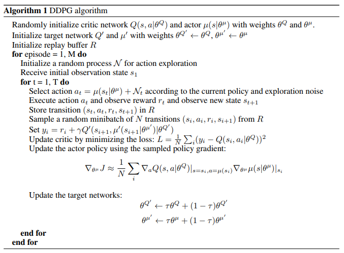
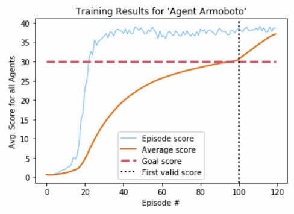

# Policy-Reacher-Critic Report: Agent Armoboto

To solve this environment a Deep Deterministic Policy Gradient (DDPG) model was used for the agent. Briefly, the DDPG agent architecture consists of four neural networks to learn from experience, and a replay buffer to store experiences that are sampled from during learning. This model allowed for training using multiple workers interacting with their own copies of the task, which all pooled into a single experience buffer and update the shared network models.  All of the arms in the multi agent training are actually learning and using the same policy to determine actions for the environment.

## Files

The following files are used for this implementation:

| Filename | Purpose |
| --- | --- |
| ```ddpg_model.py``` | Contains the Actor and Critic neural net models |
| ```ddpg_agent.py``` | Agent architecture containing all used neural networks |
| ```trainer_ddpg.py``` | Training function for DDPG agents |
| ```demos.py``` | Demos using trained or random agents |
| ```agent_utils.py``` | Utility functions including saving models and plotting |

## DDPG


*[source](https://arxiv.org/abs/1509.02971)*

### Experience Replay Buffer

Experiences of ```(state, action, reward, next_state, done)``` tuples are observed by each arm every time step and stored in the same shared Experience Replay Buffer. The replay buffer uses the ```buffer_size``` hyperparameter to determine how many experiences it should keep before discarding or 'forgetting' the oldest. During learning, ```batch_size``` samples are selected uniformly at random and used for the update, using experiences from the multiple different arms.

### Weight Copying with Soft Update

When copying the weights of the local network to the target network every ```copy_every``` time steps, a soft update method  was used instead of the original full copy method. The soft update introduces a new hyperparameter ```tau``` that controls the mixture of target and local network weights used to update the target network, helping to stabilize training.

### Ornstein-Uhlenbeck Noise

Ornstein-Uhlenbeck noise was added to the values returned by the actor network to provide an element of exploration to the actions selected by the agent.

## Network Architecture

Both the actor and critic network models contain both a local and target copy of the model, where the target weights are copied from the local network using the soft update described above.

The actor network uses a linear input layer the same size as the state space, followed immediately by a batch normalization layer before passing through a ReLU activation. Two fully connected linear hidden layers each with a ReLU activation followed. A final fully connected hidden layer matching the size of the action space and ending with a tanh activation.  Optionally noise can be added to the returned action values to encourage continued exploration.

The critic network starts with the same linear input layer the same size as the state space, with a batch normalization layer and a ReLU activation. The output from this activation is then combined with action input the size of the action space. This combined tensor becomes the input to a fully connected linear hidden layer with a ReLU activation. This goes through a final fully connected hidden layer of size 1, returning the output without any activation representing the Q value of the (state, action) critic input.

## Hyperparameters

The following table lists the hyperparameters available for this agent and training algorithm.

| Hyperparameter | Default | Description |
| ---- | --- | --- |
| name | 'default_ddpg' | Name of agent, not impact on training. Used for save directory. |
| layers_actor | [128, 128] | List of layer sizes used for the actor local and target networks. |
| layers_critic | [128, 128] | List of layer sizes used for the critic local and target networks, not including the extra action tensor |
| buffer_size | 1000000 | Length of Experience Replay Buffer. |
| batch_size | 128 | Batch size for sampling the Experience Replay Buffer. |
| lr_actor | 0.0001 | Learning rate of the actor local network. |
| lr_critic | 0.0003 | Learning rate of the critic local network. |
| gamma | 0.99 | Discount factor for future rewards. |
| tau | 0.001 | Interpolation factor for soft update. Full target copy = 0 |
| weight_decay | 0.0001 | Decay factor for critic optimizer weights |
| max_t | 1000 | Number of time steps per episode |
| t_learn | 5 | Number of time steps between every learning update |
| num_learn | 5 | Number of learning passes each learning update |

## Results

The agent trained to solved this environment, ```Agent Armoboto```, used the following network:

### Actor Network

* input layer of size ```33``` with batch normalization and ReLU activation
* hidden layer of size ```256``` with ReLU activation
* hidden layer of size ```256``` with ReLU activation
* output layer of size ```4``` with tanh activation

### Critic Network

* input layer of size ```33``` with batch normalization and ReLU activation
* hidden layer of size ```256``` + ```4``` (action space) with ReLU activation
* output layer of size ```1``` without any activation (Q-value for action-state pair)

The parameters used by ```Agent Armoboto``` almost worked with the defaults before catastrophically failing. The final chosen parameters are listed below, which used larger learning rates for both the actor and critic networks, larger actor and critic networks themselves, and a substantially larger batch size from the experience replay buffer:

| Hyperparameter | Value |
| --- | --- |
| name | 'Agent Armoboto' |
| layers_actor | [256, 256] |
| layers_critic | [256, 256] |
| buffer_size | 2000000 |
| batch_size | 1024 |
| lr_actor | 0.001 |
| lr_critic | 0.001 |
| gamma | 0.99 |
| tau | 0.001 |
| weight_decay | 0.0 |
| max_t | 1000 |
| t_learn | 20 |
| num_learn | 12 |

```Agent Armoboto``` was able to solve the environment in ```100``` episodes. Training on a consumer-grade GPU took just under 3 hours.



*Plot of agent training, with the full range of score and a smoothed average score over 100 episodes.*

Although a solved score at episode 100 would imply the weights were learned at episode 0, it is clear that the agent performs poorly during the initial few episodes. Once the agent starts to reinforce the sparse initial rewards, episodic scores rose dramatically seen around episode 20.

## Ideas for Future Work

The DDPG agent used to solve this environment showed remarkable ability to learn the task quickly. However, this baseline implementation required tuning and still showed poor performance during early episodes.

* Prioritized Experience Replay improves sample efficiency by weighting experiences based on their impact on training. This can lead to improved training time, and is used in several agent architectures.
* DDPG doesn't use TRPO seen in PPO or N-step roll outs, implementing another agent architecture and comparing performance would be interesting.

## References

* P., Timothy, et al. “Continuous Control with Deep Reinforcement Learning.” ArXiv.org, 5 July 2019, arxiv.org/abs/1509.02971.
* “Deterministic Policy Gradient Algorithms.” Deepmind, deepmind.com/research/publications/deterministic-policy-gradient-algorithms.
* Schulman, et al. “Proximal Policy Optimization Algorithms.” ArXiv.org, 28 Aug. 2017, arxiv.org/abs/1707.06347.
* Udacity Deep Reinforcement Learning Nanodegree Program, https://www.udacity.com/course/deep-reinforcement-learning-nanodegree--nd893.

## Additional Material

### Saved Agent Structure

Agents are saved during training to the ```saved_agents/[agent_name]/``` directory, where ```[agent_name]``` is the agent name. The created agent directory contains the files outlined below, saving properties of the agent and results of training.

| Filename(s) | Description |
| --- | ---- |
| actor_weights.pyt | Final weights for the actor network |
| critic_weights.pyt | Final weights for the critic network |
| params.json | Hyperparameters used for this agent, saved as a json dictionary |
| scores.npy | Scores the agent earned during training, in the numpy .npy format |
| /.checkpoints/[ep_#]-actor_weights.pyt | Checkpoints for actor network weights |
| /.checkpoints/[ep_#]-critic_weights.pyt | Checkpoints for critic network weights |
| /.checkpoints/[ep_#]-scores.npy | Checkpoints for training scores |
